.. _data_quality:

Data Quality Control Plots
--------------------------
Among the data products, the pipeline generates a set of plots used to assess the quality of the reduction. These plots are contained in the data_products/plots directory, organized by arm into the blue and red directories, respectively. The plots you will find there are the following:

Bias: bias.png
~~~~~~~~~~~~~~
This figure shows in red the bias along the X-axis, averaged over the Y direction.

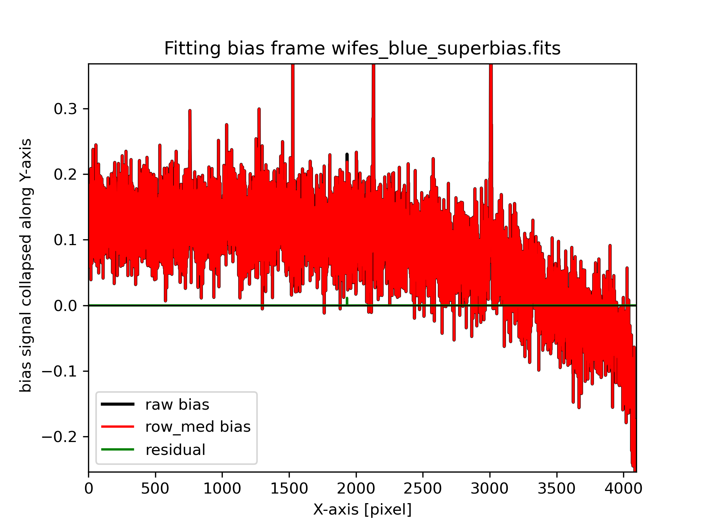

Dome/Twilight Flat Inputs: dflat_imcombine_inputs.png / twi_imcombine_inputs.png
~~~~~~~~~~~~~~~~~~~~~~~~~~~~~~~~~~~~~~~~~~~~~~~~~~~~~~~~~~~~~~~~~~~~~~~~~~~~~~~~
This plot shows the individual inputs to the flatfield combinations. If there are many inputs, the code and the plots are split into x-axis chunks. The plot shows (top) the first quarter of the x-axis range, and (bottom) the last quarter of the x-axis range. Colour-coding of each spectrum is identical between the two panels. The top panel includes small vertical offsets for each input.

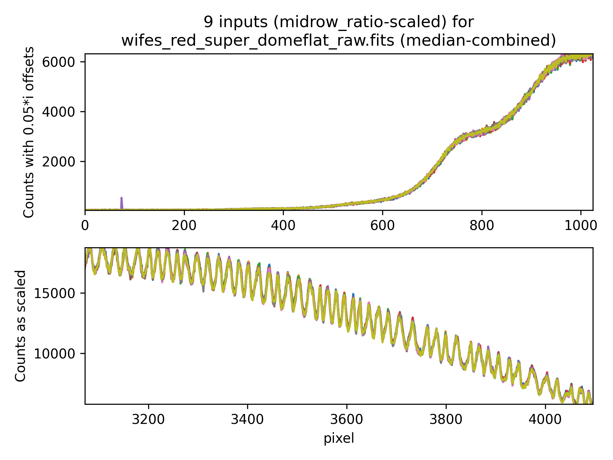

Raw Dome/Twilight Flat: raw_domeflat_check.png / raw_twiflat_check.png
~~~~~~~~~~~~~~~~~~~~~~~~~~~~~~~~~~~~~~~~~~~~~~~~~~~~~~~~~~~~~~~~~~~~~~
This plot displays the counts in combined flatfield images (dome or twilight superflats) and shows all the defined slitlets. The colored numbers on the slitlets are consistent between the two plots: the 1-D collapsed plot and the 2-D raw image.

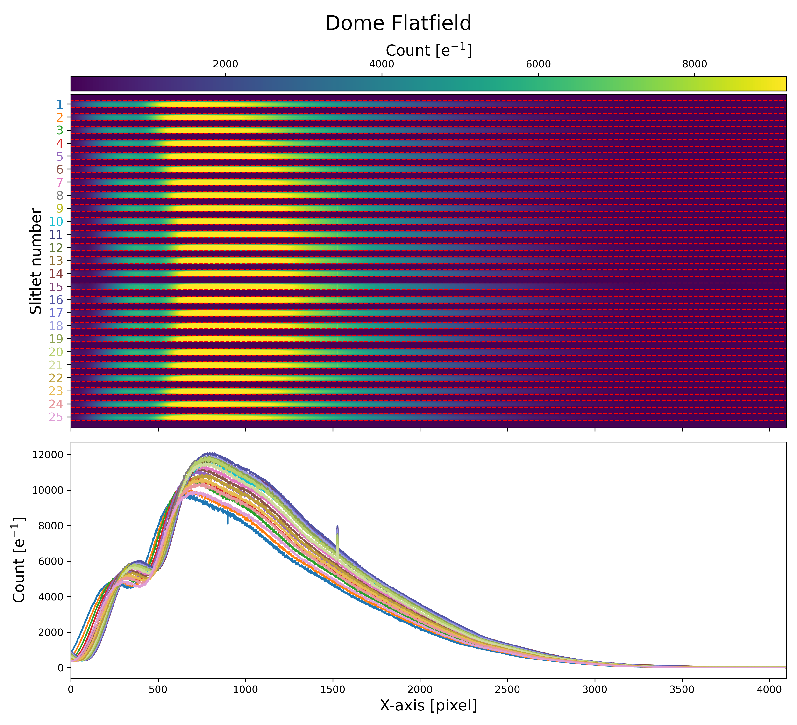

Dome/Twilight Flat Cleanup: domeflat_cleanup.png/twiflat_cleanup.png
~~~~~~~~~~~~~~~~~~~~~~~~~~~~~~~~~~~~~~~~~~~~~~~~~~~~~~~~~~~~~~~~~~~~
Cleaning Flatfield. Top: Raw master lamp flat. The scattered light is clearly visible in the center 
of the image. Middle: reconstructed scattered light from the interslit regions. 
Bottom: cleaned master flat image.

.. image:: _static/domeflat_cleanup.png 
   :alt: Dome Flat
   :align: center

Wavelength Solution: wavelength_solution.png
~~~~~~~~~~~~~~~~~~~~~~~~~~~~~~~~~~~~~~~~~~~~
Top Left: All detected arc lines in the detector plane, illustrating the curved shape of the WiFeS wavelength solution.
Top Right: Residuals of fitted emission line centers compared to the predictions from the best-fit optical model, plotted as a function of detector X and Y.
Bottom Left: Residuals of fitted emission line centers as a function of wavelength.
Bottom Right: Histogram of the residuals, showing their distribution.

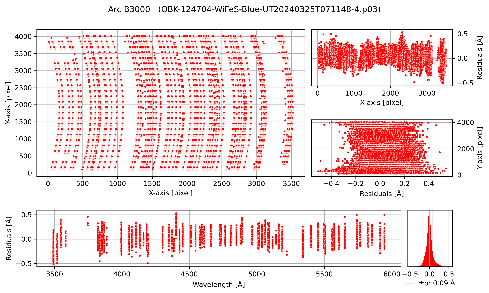

Wire Solution: wire_fit_params.png
~~~~~~~~~~~~~~~~~~~~~~~~~~~~~~~~~~
Slope of the wire fit for each slitlet.

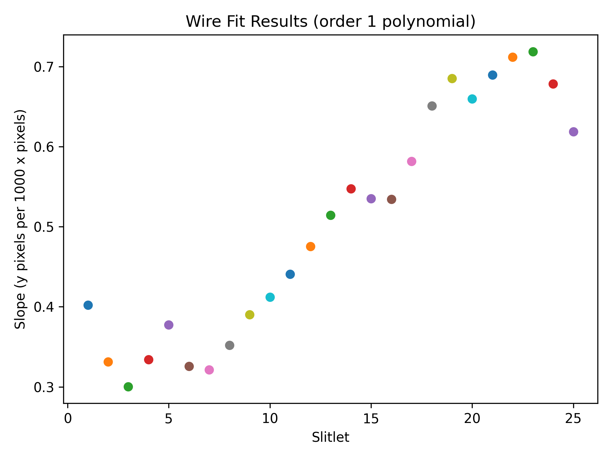

Flat Response: flat_response.png
~~~~~~~~~~~~~~~~~~~~~~~~~~~~~~~~
Left: Fit of a smooth function (dashed red) to the flat lamp spectrum (blue), correcting for cold pixels, fringing, and "dichroic wiggles".
Right: Illumination correction derived from twilight flat data, before adjusting for vertical offsets between slitlets.

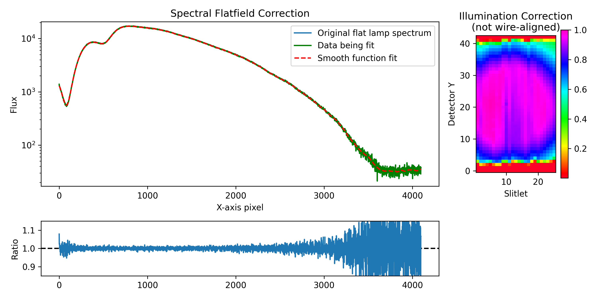

Standard Star: STANDARD_STAR_NAME.png
~~~~~~~~~~~~~~~~~~~~~~~~~~~~~~~~~~~~~
This plot shows the observed standard star (in red) scaled to the standard star reference data (in blue).

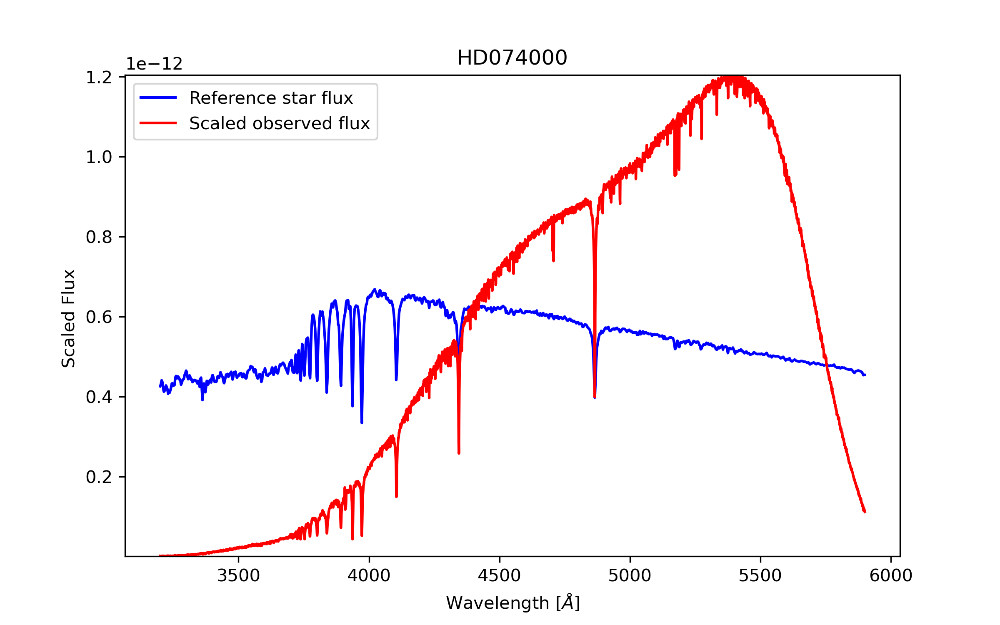

Flux Calibration: flux_calibration_solution.png
~~~~~~~~~~~~~~~~~~~~~~~~~~~~~~~~~~~~~~~~~~~~~~~
Top: Flux calibration solution (solid green line) derived from flux-to-counts ratio (in magnitudes) observed in data (red dots).
Bottom: Residuals around the fit. Bottom Right: Histogram of residuals with dashed lines plotted at +/- 1 sigma.

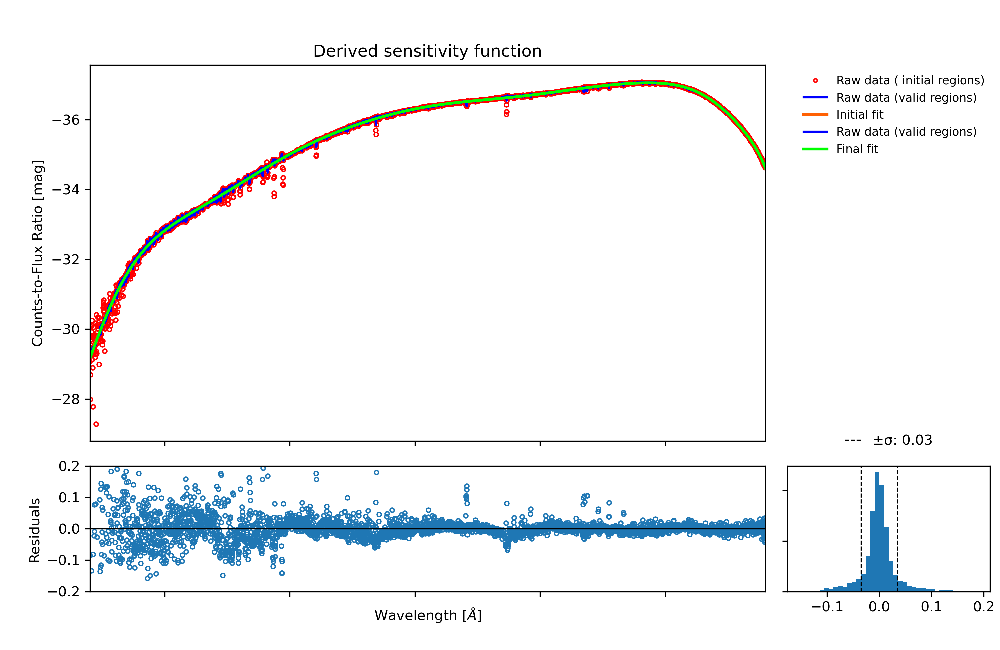

Telluric Correction: telluric_correction.png
~~~~~~~~~~~~~~~~~~~~~~~~~~~~~~~~~~~~~~~~~~~~
Top figure: Observed telluric star and the fitting to the continuum for normalizing it.  
Bottom figure: Calculated telluric correction (black). Purple regions indicate :math:`O_2` bands, while blue regions indicate :math:`H_2O` bands.

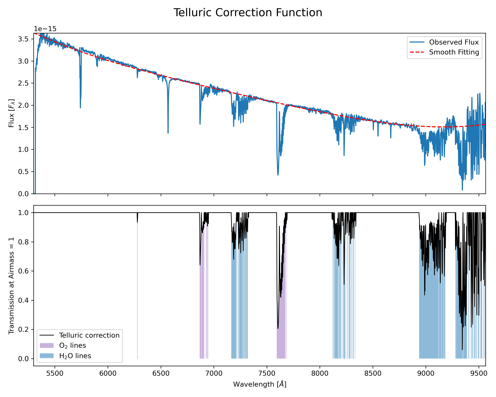

Automatic Detected Source(s): xxx-WiFeS-UTxxx-4_detection_plot.png
~~~~~~~~~~~~~~~~~~~~~~~~~~~~~~~~~~~~~~~~~~~~~~~~~~~~~~~~~~~~~~~~~~
Collapsed data cube images for both arms. This plot shows the automatically detected (up to three brightest) and extracted sources. The dashed lines indicate the theoretical circular apertures considered, and the white shaded areas are the actual pixels falling inside the defined apertures and being considered in the extraction. A circular annulus indicating the aperture used for extracting the sky (when applicable) is shown. Extraction plots are generated for science sources and also for standard stars.

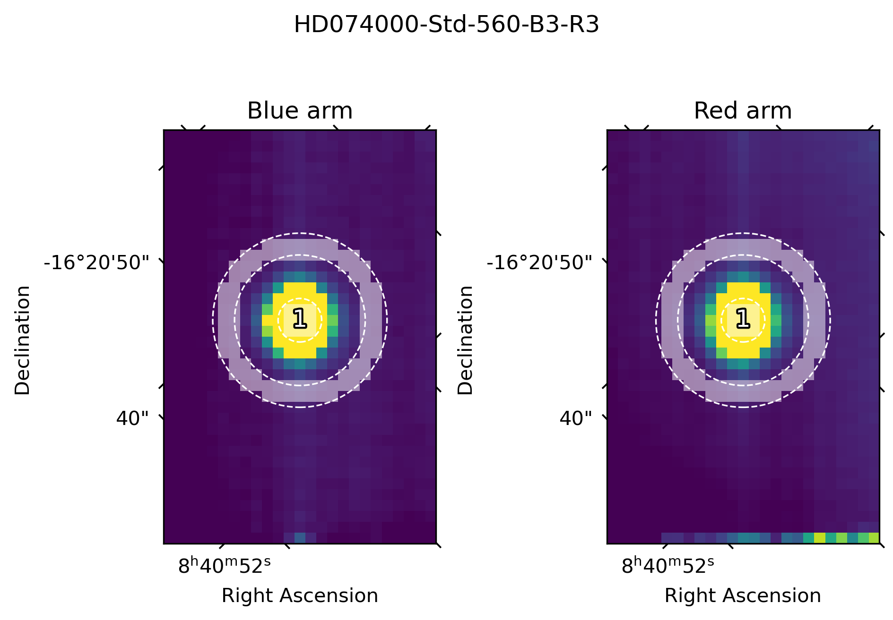

Automatic Extracted Spectrum: xxx-WiFeS-xxx.spec.apx.png
~~~~~~~~~~~~~~~~~~~~~~~~~~~~~~~~~~~~~~~~~~~~~~~~~~~~~~~~
Plot of extracted spectrum for one aperture. Versions are generated for each arm, as well as for the spliced spectrum, if generated.

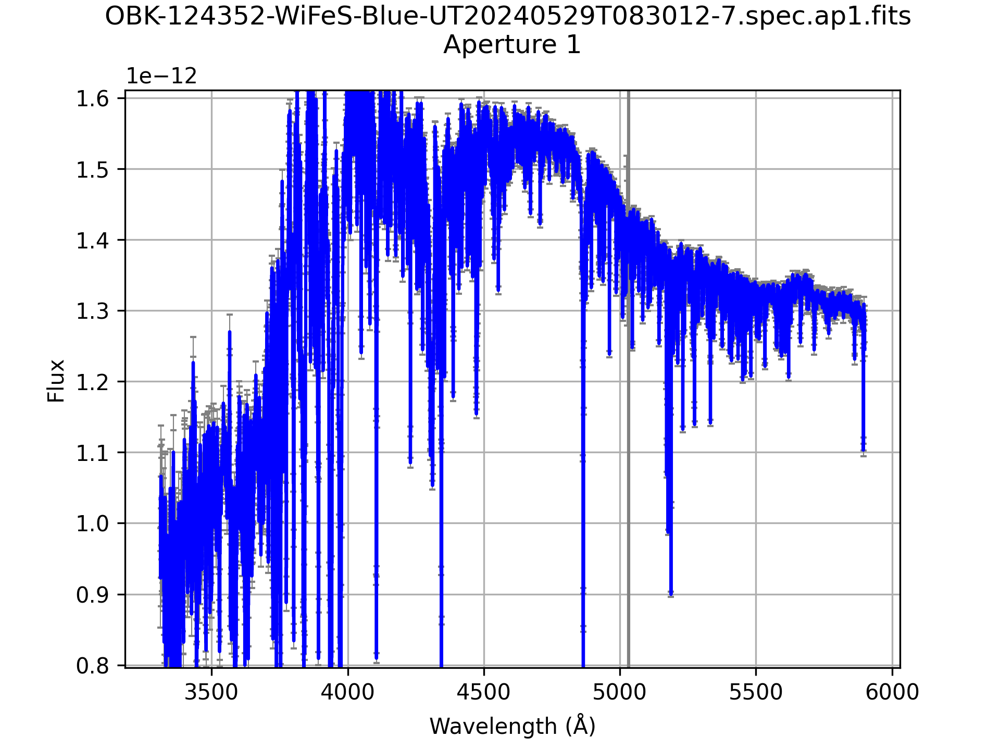
