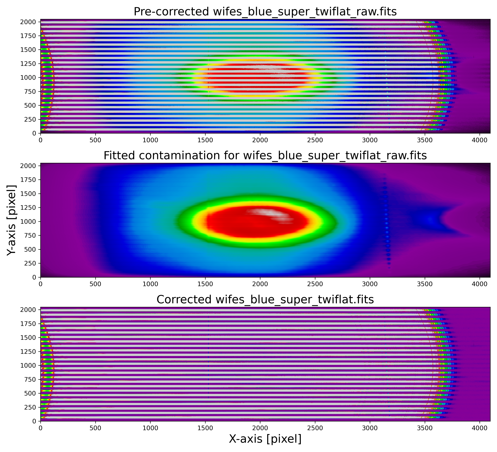
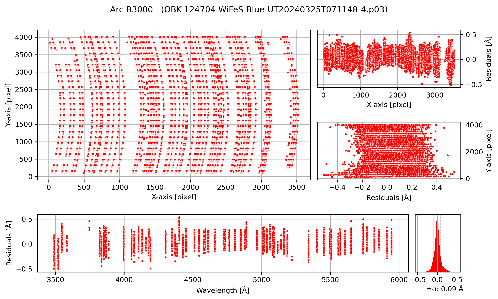

.. _data_quality:

Data Quality Control Plots
--------------------------

Among the data products, the pipeline generates a set of plots used to assess the quality of the reduction. These plots are contained in the data_products/plots directory, organized by arm into the blue and red directories, respectively. The plots you will find there are the following:

Bias: bias.png
~~~~~~~~~~~~~~~

This figure shows in red the bias along the X-axis, averaged over the Y direction.

.. image:: _static/bias.png
   :alt: Bias
   :align: center

Standard Star: STANDARD_STAR_NAME.png
~~~~~~~~~~~~~~~~~~~~~~~~~~~~~~~~~~~~~~

This plot shows the observed standard star (in red) scaled to the standard star reference data (in blue).

.. image:: _static/HD074000.png 
   :alt: Standard Star
   :align: center

Flux Calibration: flux_calibration_solution.png
~~~~~~~~~~~~~~~~~~~~~~~~~~~~~~~~~~~~~~~~~~~~~~~~

.. image:: _static/flux_calibration_solution.png 
   :alt: Flux Calibration
   :align: center

Dome Flat: domeflat_cleanup.png
~~~~~~~~~~~~~~~~~~~~~~~~~~~~~~~~

.. image:: _static/domeflat_cleanup.png 
   :alt: Dome Flat
   :align: center

Twilight Flat: twiflat_cleanup.png
~~~~~~~~~~~~~~~~~~~~~~~~~~~~~~~~~~~

Flat Response: flat_response.png
~~~~~~~~~~~~~~~~~~~~~~~~~~~~~~~~~

Left: Fit of a smooth function (dashed red) to the flat lamp spectrum (blue), correcting for cold pixels, fringing, and "dichroic wiggles".
Right: Illumination correction derived from sky flat data, before adjusting for vertical offsets between slitlets.

.. image:: _static/flat_response.png 
   :alt: Flat Response   
   :align: center

Wavelenght Solution: wavelenght_solution.png
~~~~~~~~~~~~~~~~~~~~~~~~~~~~~~~~~~~~~~~~~~~~~

Telluric Correction (telluric_correction.png)
~~~~~~~~~~~~~~~~~~~~~~~~~~~~~~~~~~~~~~~~~~~~~

Top figure: Observed telluric star and the fitting to the continuum for normalizing it.  
Bottom figure: Calculated telluric correction (black). Purple regions indicate :math:`O_2` bands, while blue regions indicate :math:`H_2O` bands.

.. image:: _static/telluric_correction.png 
   :alt: Telluric Correction
   :align: center

Automatic Detected Source(s): xxx-WiFeS-UTxxx-4_detection_plot.png
~~~~~~~~~~~~~~~~~~~~~~~~~~~~~~~~~~~~~~~~~~~~~~~~~~~~~~~~~~~~~~~~~~

Collapsed data cube images for both arms. This plot shows the automatically detected (up to three brightest) and extracted sources. The dashed lines indicate the theoretical circular apertures considered, and the white shaded areas are the actual pixels falling inside the defined apertures and being considered in the extraction. A circular annulus indicating the aperture used for extracting the sky (when applicable) is shown. Extraction plots are generated for science sources and also for standard stars.

.. image:: _static/OBK-124224-WiFeS-UT20240324T092437-4_detection_plot.png 
   :alt: Telluric Correction
   :align: center
